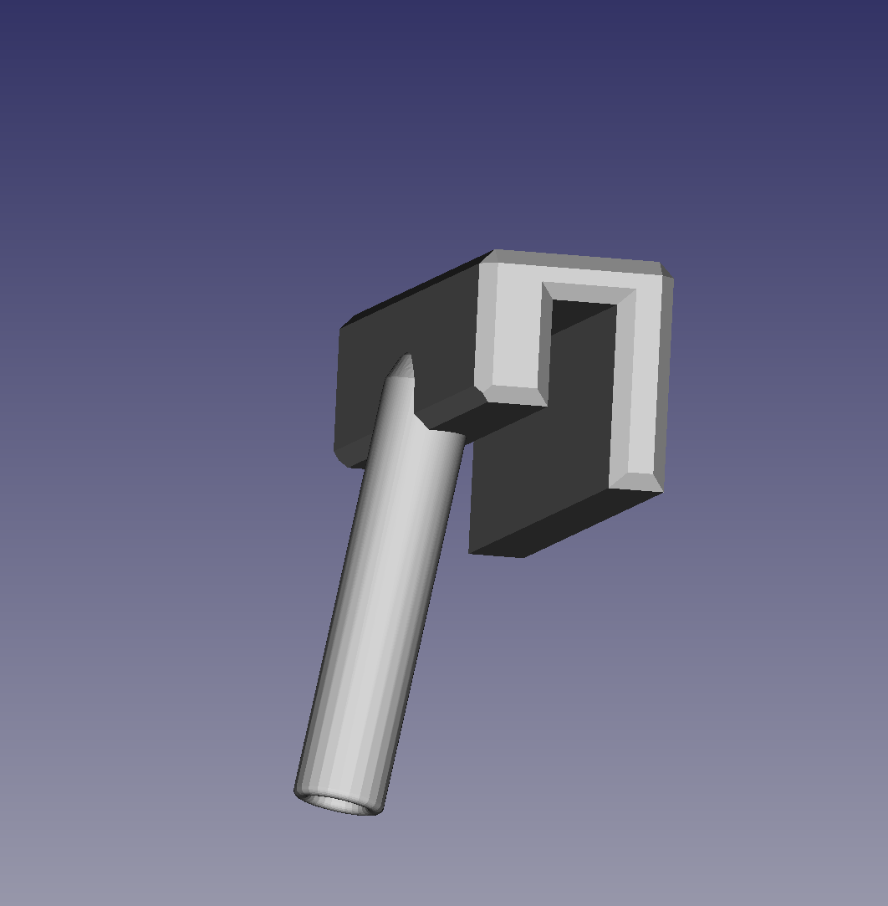

# Various aquarium holders / adapters
Sources are created with *FreeCAD 0.21.2, Libs: 0.21.2R*

## LED light bar holder for 60cm aquarium (4mm glass, WellerLED bars)
{width=500px}
{width=500px}

## Sensor holder (water filling sensor for Eheim Vivaline)
{width=500px}
{width=500px}

## Sensor holder adapter for 4mm glass 90°
{width=500px}
{width=500px}

## Shrimp stick holders
{width=500px}
{width=500px}
{width=500px}
{width=500px}
{width=500px}
{width=500px}

## Eheim Plant holder
{width=500px}
{width=500px}

# Eheim tubes holder
{width=500px}
{width=500px}